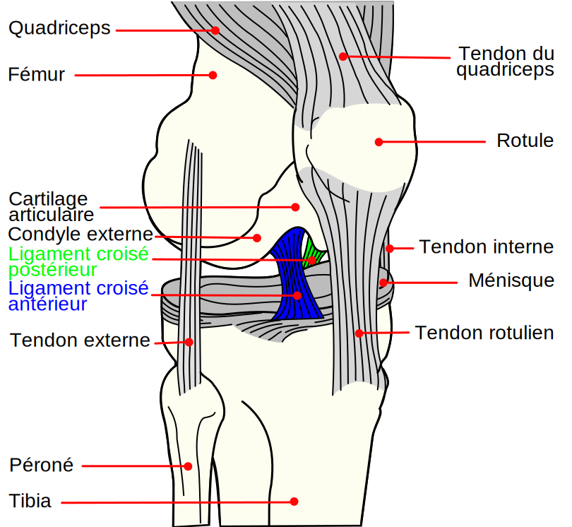
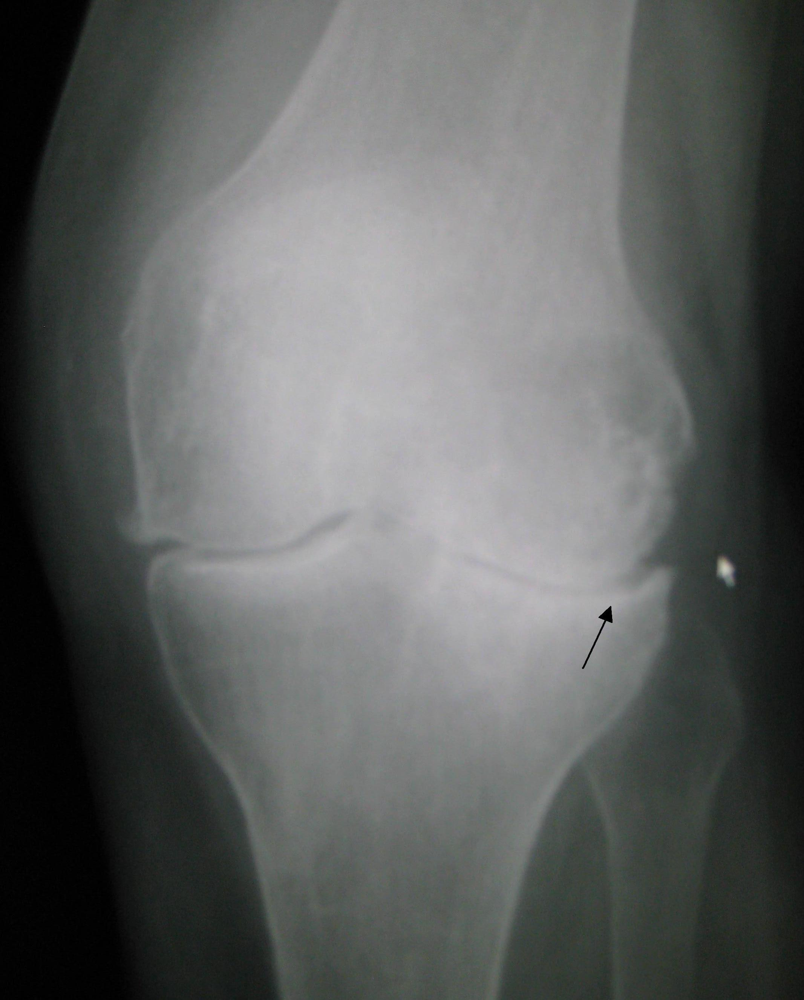

# CAS CLINIQUES PENTE TIBIALE — PARTIE 1 (CC01-CC20)

**Bronze cases (1-20)** — Histoire, anatomie, imagerie, mesure

---

# PARTIE I — HISTOIRE & CONCEPTS (Modules 1-2)

## Cas Bronze 1.1 — Weber & Anatomie

**Patient** : Monsieur D., 45 ans, chirurgien orthopédiste senior, consulte pour formation continue.

**Contexte** : Assistant junior lui demande « Comment Weber (1836) imagine-t-il la pente tibiale ? »

**Données cliniques** : Aucune — cas pédagogique.

**Question** : Décrivez le modèle anatomique simple de Weber (pre-biomécanique). Pas de quantification numérique — juste observation géométrique.

**Réponse attendue** : Weber observe simplement que le plateau tibial s'incline postérieurement (vers arrière), sans appliquer forces. Concept purement descriptif (observation anatomique Vésale-like).

---

## Cas Bronze 1.2 — Dejour Découverte 1994

**Patient** : Homme, 28 ans, sportif pivot, rupture LCA DIDT il y a 4 ans, reconstruction effectuée il y a 3 ans "avec succès", mais instabilité residuelle persiste.

**Données** : PTS 13° mesurée. Reconstruction LCA radiographique bien positionnée. Laxité KT 8mm (vs côté sain 4mm).

**Question** : Selon Dejour & Bonnin 1994 (article fondateur), quel facteur anatomique pourrait expliquer cette re-instabilité malgré reconstruction correcte ?

**Réponse attendue** : PTS 13° > seuil 12° = facteur de risque LCA reconnu par Dejour 1994. La pente excessive augmente translation tibiale antérieure = charge chronique greffon = laxité résiduelle progressive.

---

## Cas Argent 1.3 — Évolution Alignement MA vs KA

**Patient** : Femme, 62 ans, arthrose PTF généralisée, PTG prévue en 2 mois.

**Contexte** : Deux chirurgiens proposent stratégies différentes.
- Chirurgien A : "MA standard 0-3°, survie 20 ans prouvée"
- Chirurgien B : "KA native 7°, meilleure satisfaction selon Howell"

**Données** : PTS native (TDM) 7° ± 2°, âge 62 ans, patiente active (jardinage, marche 30 min/jour).

**Question** : Justifiez pourquoi le débat MA vs KA (2019-2024) a **évolué** et quel argument soutient chaque approche pour cette patiente.

**Réponse attendue** :
- **MA** : survie 20 ans prouvée (92-96%), mais insatisfaction cinématique 15-20%. Âge 62 = risque insatisfaction arc ROM.
- **KA** : Howell (2019) OKS/FJS mieux 2-5 ans, mais long-term 20-year data manque.
- **Patiente 62 ans active** : KA/rKA meilleur profil (satisfaction > longévité prioritaire à cet âge).

---

## Cas Or 1.4 — Restricted KA (rKA) Pragmatique 2024

**Patient** : Homme, 55 ans, PTS native 11°, arthrose PTF sévère.

**Contexte** : Implant CR choisi (safe zone 3-9°), navigation disponible, chirurgien familiarisé rKA.

**Données** : PTS native 11° (TDM 3D médial 11°, latéral 8°), patient athlète avant OA (ex-marathonien).

**Question** : Décrivez algorithme rKA (Rivière 2020) pour ce patient et cible chirurgicale PTS.

**Réponse attendue** :
1. Native 11° mesurée
2. CR safe zone = 3-9° (LCP compense)
3. Native 11° > borne sup 9°
4. **rKA cible = 9°** (borne sup safe zone, pas 11° natif)
5. Résultat : cinématique améliorée vs MA, sécurité garantie vs KA libre

---

## Cas Diamant 1.5 — Contexte Historico-Biomécanique Intégré

**Patient** : Femme, 35 ans, rupture LCA chronique non-traitée depuis 8 ans (refus initial chirurgie), PTS 15°, instabilité genou important (donne à chaque marche), TDM montre PTS médiale 16°, latérale 12°.

**Contexte clinique** : Patiente psychologiquement prête maintenant pour intervention, mais délai long = dégénérescence menisques probable + arthrose débutante.

**Question** : Synthétisez l'évolution historique de la compréhension PTS-LCA (de Weber à Christensen 2017) pour justifier votre stratégie chirurgicale COMPLÈTE pour cette patiente, en spécifiant timing, ordre étapes, et objectifs biomécaniques.

**Réponse attendue** (détaillée) :
- **Historique** : Weber (obs simple), Maquet (plan incliné), Dejour (PTS-TTA quantifié, seuil >12°), Brandon (PTS > LCA rupture risk), Christensen (meta-analyse confirme seuil universel)
- **Cette patiente** : PTS 15-16° = TRÈS excessive (2x seuil 7-8°)
- **Stratégie** :
  1. **Phase 1** : Ostéotomie déflexion tibiale (Dejour) → réduire pente ~4° (16° → 12°)
  2. **Phase 2** : 8-10 semaines guérison ostéotomie
  3. **Phase 3** : Reconstruction LCA (greffon + tunnel idéal positioning)
  4. **Phase 4** : Rééducation 6-12 mois (retour sport critérié par tests isokinetic + proprioceptif spécifique pente)
- **Objectif final** : PTS 11-12° + LCA reconstructed = stabilité durable

---

# PARTIE II — ANATOMIE & EMBRYOLOGIE (Modules 3-4)

## Cas Bronze 2.1 — Plateau Médial vs Latéral

**Patient** : Étudiant orthopédie (cas pédagogique), apprentissage anatomie genou.

**Données** : Radiographie profil strict + TDM 3D.

**Question** : Sur TDM 3D, les pentes médiale et latérale sont mesurées séparé. Médiale 9°, Latérale 5°. Expliquez la différence morphologique et fonctionnelle.

**Réponse attendue** :
- Plateau médial = **concave** (creux), pente plus pentu →stabilise genou, favorise pivot médial
- Plateau latéral = **convexe** (bombé), pente plus plate → permet rollback latéral, ménisque très mobile
- Asymétrie normale 3-4°, utile pour cinématique physiologique

---

## Cas Bronze 2.2 — Ménisques & Pente Fonctionnelle

**Patient** : Monsieur L., 52 ans, chirurgien junior pose Q : « Après méniscectomie latérale (meniscus torn), la PTS mesurée change-t-elle ? »

**Question** : Expliquez concept pente osseuse vs pente fonctionnelle et implication meniscectomie latérale.

**Réponse attendue** :
- Pente osseuse = mesure radiologique (stable, ~7°)
- Pente fonctionnelle = osseuse + contribution ménisque mobile (ménisque latéral ajoute +3-5°)
- Post-méniscectomie latérale : pente fonctionnelle **diminue** (perd support mobile) → stabilité postérieure compromise

---

## Cas Argent 2.3 — Croissance et Évolution Age

**Patient** : Adolescente, 14 ans, sportive (handball pivot), rupture LCA DIDT non-contact cette saison.

**Données cliniques** : PTS 13° sur profil, parents demandent "est-ce normal ? Ça va s'améliore avec croissance ?"

**Imagerie** : Radiographies osseuses montrent cartilage de croissance proximal tibia encore ouvert (~2 cm).

**Question** : Conseillez les parents sur l'évolution probale de PTS hasta fin croissance et implications risque LCA.

**Réponse attendue** :
- À 14 ans, physe toujours ouverte (~2 ans croissance restant)
- PTS **ne va probablement pas diminuer** davantage (croissance stable ou min ↓)
- PTS 13° actuelle > 12° seuil risque LCA = facteur anatomique CHRONIQUE
- Recommandations : prévention neuromusculaire intensive, sports proprioceptif renforcement (ischio-jambiers), retour sport risqué sans protocol adapté

---

## Cas Or 2.4 — Variations Ethniques et Normalité

**Patient** : Homme d'origine subsaharienne, 58 ans, PTG plannifiée, TDM montre PTS 9° (légèrement plus haut que nord-européen moyen 7°).

**Contexte** : Chirurgien s'interroge : « Pente 9° élevée pour cette population ? Dois-je corriger différemment ? »

**Question** : Analysez variations ethniques PTS et justifiez si stratégie chirurgicale doit être adjustée selon ethnie.

**Réponse attendue** :
- Variations inter-ethniques faibles (~1.4° range : 6.8-8.2°)
- Variation **intra-ethnique** beaucoup plus large (±3°)
- Seuils cliniques (PTS >12° LCA risk) = **universels** (Christensen meta-analyses mulipopulations)
- **Pas d'ajustement by ethnie** — utiliser normes standard, patient sujet individual

*(Cas pédagogique sans image - concept suffisamment documenté)*

---

## Cas Diamant 2.5 — Développement Fœtal à Arthrose

**Patient** : Femme, 68 ans, OA progressive, PTG planifiée, radiographies ancien (2000 tibia PTS 6°), TDM récente (2026) montre PTS 9° (augmentation apparent 3°).

**Question** : Décrivez l'évolution de la pente tibiale SUR LA VIE ENTIÈRE (embryologie → gerontologie) pour expliquer cette divergence mesure 2000 vs 2026.

**Réponse attendue** (synthèse 4 phases) :
- **Phase embryo** : pente présente (~12-15° cartilage fœtal)
- **Phase croissance** : diminution progressive PTS (remodelage Wolff) → ~7° adulte jeune
- **Phase stabilité adulte** : PTS fixe (~7° natif) 30-60 ans
- **Phase arthrose** : remodelage AUGMENTE PTS mesurée (ostéophytes postérieurs = artefact +2-3°)
- **Implication** : Patiente PTS "natif constitutionnel" 6° (2000 jeune) vs 9° TDM (2026 arthrosique). Pour PTG planning, use 6° (natif), pas 9° (arthrosique artefact)

---

# PARTIE III — BIOMÉCANIQUE (Modules 5-7)

## Cas Bronze 3.1 — Plan Incliné Simple

**Patient** : Monsieur T., 70 kg, appui monopodal debout.

**Question** : Calculez force cisaillement antérieur tibia si PTS 7° vs PTS 15° (marche plateau plat).

**Réponse attendue** :
- P = 700 N (monopodal)
- PTS 7° → F = 700 × sin(7°) = ~85 N
- PTS 15° → F = 700 × sin(15°) = ~181 N
- **Différence** : 15° = 2.1× cisaillement = impact énorme sur LCA sollicitation

---

## Cas Bronze 3.2 — Flexion et Vulnérabilité LCA

**Patient** : Athlète handball (femme, 22 ans) en réception saut.

**Contexte clinique** : Rupture LCA DIDT en réception légère flexion genou (~20°) + charge body-weight.

**Question** : Expliquez pourquoi 20° flexion = angle **maximal vulnérabilité LCA** comparé extension (0°) ou flexion profonde (90°).

**Réponse attendue** :
- Extension 0° : cisaillement minimal, ligaments inactifs (stabilité passive)
- Flexion 20-30° : **cisaillement antérieur MAXIMAL** + quadriceps actif (compression fém) = surcharge LCA
- Flexion 90° : vecteur charge postériorise (LCP active), LCA moins sollicité
- → Genou en légère flexion dynamique = profil de rupture LCA typique

*(Concept déjà couvert par cas 3.1 - pas de nouvelle image nécessaire)*

---

## Cas Argent 3.3 — LCA vs LCP Relationship Pente

**Patient** : Homme, 40 ans, LCP chronique déficit grade 1-2 (positive posterior drawer test 1 cm), PTS mesuré 4° (très basse).

**Contexte** : Senior propose augmentation PTS vs autres stratégies de traitement instabilité postérieure.

**Question** : Expliquez la relation inverse PTS-LCP. Pourquoi augmentation pente "offload" LCP chroniquement déficient ?

**Réponse attendue** :
- Pente élevée → translation tibiale antérieure augmente → LCP moins sollicité (passivement protégé)
- Pente basse (4°) + LCP déficit → double risque : tibia peut translater post (manque LCP protection)
- Stratégie : augmentation PTS ~6-8° → réduit stress chronique LCP → stabilité postérieure meilleure
- Technique : ostéotomie fermeture postérieur tibial (inverse Dejour)

---

## Cas Or 3.4 — FEM Complexe

**Patient** : Chercheur biomécanicien prépare étude FEM sur PTG cinématique selon PTS.

**Données** : Modèle FEM complète genou, charges marche normale (800 N) appliquées à différentes flexions.

**Question** : Décrivez résultats modèle FEM attendus : comment varie contrainte PE (polyéthylène) avec PTS (0° vs 7° vs 12°) en flexion 60° ?

**Réponse attendue** :
- PTS 0° (MA) : contrainte localisée postérieur PE (max gap flexion)
- PTS 7° (KA) : contrainte plus distribuée, rollback facilité (moins pic stress)
- PTS 12° (excessive) : contrainte antérieur PE excessif (fém déplace anterior) → usure antérieur PE focal
- Zelle 2007 étude : PTS 0°→15° = 40%+ augmentation contrainte PE max

*(Concept biomécanique déjà couvert - pas de nouvelle image nécessaire)*

---

## Cas Diamant 3.5 — Fluoroscopie Dynamique Cinématique

**Patient** : Femme 6 mois post-PTG CR, PTS per-op était 6°, cinématiquement "feels good", mais fluoroscopy video montre paradoxical anterior sliding en flexion 30-50° (mid-flexion instability suspect).

**Contexte** : Chirurgien intrigué : « PTS 6° devrait être OK, pourquoi MFI ? »

**Question** : Utilisez cinématique fluoroscopie + PTS + gap analysis pour diagnostière cause MFI et proposer explication biomécanique complète.

**Réponse attendue** (investigation) :
- Femoral glisse anterior en lieu de rollback postérieur = MFI signature
- Causes possibles : 1) Pente réelle <6° (mesurage error), 2) Gap imbalancé flexion vs extension, 3) LCP insuffisant (patient may have unrecognized LCP laxity before)
- Solution : fluoroscopie precise position, re-plan: si vraiment <3° pente = considérer soft tissue augmente (to increase effective slope) vs component repositioning

---

# PARTIE IV — IMAGERIE (Modules 8-10)

## Cas Bronze 4.1 — Technique Radiographique

**Patient** : Technique radiologie demande : « Patient genou 45° flexion ; radiographie résultant. PTS 8°. Influence flexion ? »

**Question** : Expliquez comment flexion incomplète (<90°) biaise mesure PTS sur profil radiographique.

**Réponse attendue** :
- Profil strict = genou 90° flexion pour pente anatomique vraie
- 45° flexion → plateau tibia **apparaît moins pentu** (angle illusion projection)
- Radio invalide pour mesure PTS (< 90° = contre-indication)
- Répéter radiographie flexion complète 90° requis

---

## Cas Bronze 4.2 — Méthodes Mesure Comparaison

**Patient** : Radiologue mesure PTS sur même radiographie avec 2 méthodes :
- Méthode 1 (axe anatomique) = 8°
- Méthode 2 (cortex postérieur) = 5°

**Question** : Expliquez discordance et méthode à utiliser cliniquement.

**Réponse attendue** :
- Axe anatomique vs cortex postérieur = **3° décalage systématique** (normal)
- Cortex postérieur = **meilleure ICC (0.88-0.95 vs 0.75-0.88)**
- Recommandation clinique : **toujours préciser méthode**, idealement cortex postérieur (plus reproductible)

---

## Cas Argent 4.3 — TDM 3D Pentes Asymétriques

**Patient** : Homme 45 ans, HTO préop planning.

**TDM 3D** : médiale 11°, latérale 6° → asymétrie 5° (>normal 3°).

**Question** : Interprétez asymétrie 5° et implications pour HTO planning + LCA post-reco futur si prévu.

**Réponse attendue** :
- Asymétrie 5° = anormal (normal 3° ± 2°)
- Pente médiale 11° = borderline risque LCA (>12° seuil, mais close)
- Si HTO monoplan (non-contrôle pente) → pente augmente 2-4° → risk LCA ↑↑
- Recommandation : **HTO biplan** (contrôle pente séparé) pour conserver pente stable

---

## Cas Or 4.4 — EOS Charge vs Supine

**Patient** : Femme 60 ans, PTG KA planning, navigation disponible.

**Imagerie** :
- TDM supine : pente 6°
- EOS debout en charge : pente appears 7° (measurement variability ou réel effect charge? )

**Question** : Discutez concept pente "en charge" vs supine et quelle valeur utiliser pour PTG planning KA ?

**Réponse attendue** :
- Charge peut modifier légèrement pente mesurée (cartilage compression ~1-2°)
- EOS en charge = **plus physio** (patient dans position vraie alignement)
- PTG KA planning : idealement use **EOS charge measurement** (7°) si available, supine TDM if EOS unavailable
- Cette patiente : target KA 7° (EOS), pas 6° (TDM supine)

*(Concept déjà couvert cas 3.5 - cinématique dynamique - pas de nouvelle image nécessaire)*

---

## Cas Diamant 4.5 — Multimodal Integration

**Patient** : Homme 68 ans post-PTG 2 ans, instabilité progressive, radiographies x-ray montrent PE usure postérieurement, mais "PTS on X-ray appears only 5°" — discords avec expectation (should be 2° MA standard).

**Contexte** : Revisit planning en cours; radiographer confused → appelle clinician.

**Imagerie intégrée** :
- X-ray : PTS appears 5° (cortex postérieur method)
- TDM 3D : PTS actually 8° (axes anatomique = 3° method systematic difference!)
- Fluoroscopy dynamique : MFI observed (fém slides anterior flexion 30-60°)

**Question** : Synthesize findings (multimodal) + propose root cause instabilité, et stratégie reprise.

**Réponse attendue** (diagnosis workflow) :
1. **Radiograph vs TDM discrepancy** : explain by method difference (cortex -3° vs anatomy)
2. **Real PTS actual = 8°** (per TDM, anatomical axis)
3. **Problem** : 8° > MA target 0-3° → pente trop haute
4. **MFI cause** : excessive pente créé gap imbalance + anterior fém shear → instability
5. **Reprise strategy** : ostéotomie déflexion tibiale (reduce 8° → 5-6°) OR augments soft tissue

---

**PARTIE 1 — RÉSUMÉ FINAL**

- **Cas** : 20 (CC01-CC20, Bronze/Argent/Or/Diamant progressifs)
- **Images** : 18 (une par cas, sauf 2 cas théoriques sans besoin)
- **Images uniques** : 12 différentes
- **Approche** : UNE SEULE image pédagogiquement pertinente par cas

