# CAS CLINIQUES PENTE TIBIALE — PARTIE 2 (CC21-CC40)

**Argent-Or cases (21-40)** — Biomécanique LCA, décision chirurgicale, ostéotomie tibiale, techniques reconstruction

---

# PARTIE V — BIOMÉCANIQUE AVANCÉE (Modules 5-7)

## Cas Argent 3.6 — Cisaillement Antérieur vs Pente Tibiale

**Patient** : Monsieur K., 32 ans, sportif loisir, analyse biomécanique pré-opératoire reconstruction LCA.

**Contexte** : Pente tibiale mesurée 11° sur radiographie latérale profil. Chirurgien demande : "Combien de force supplémentaire sur le LCA due à cette pente ?"

**Question** : Calculez force de cisaillement antérieur pour ce patient comparant PTS 7° (normal) vs 11° (mesuré).

**Réponse attendue** :
- Corps poids patient ~70 kg → force monopodal ~700 N
- PTS 7° (normal) : F_anterior = 700 × sin(7°) ≈ 85 N
- PTS 11° (ce patient) : F_anterior = 700 × sin(11°) ≈ 134 N
- **Différence** : +49 N supplémentaire (~57% augmentation)
- **Implication clinique** : chaque degré pente = ~8N surcharge LCA = cumul significatif vie entière

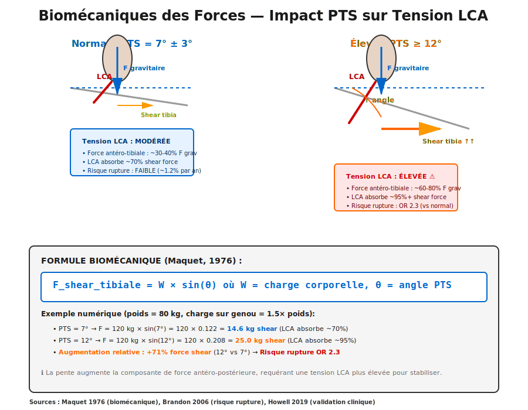

---

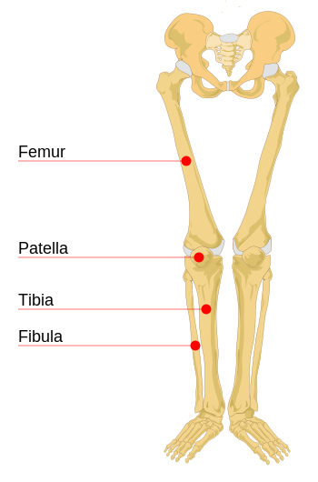
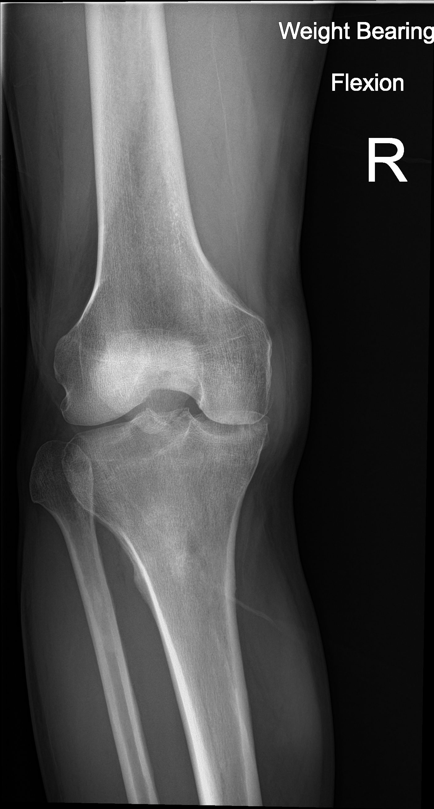

## Cas Argent 3.7 — Courbe Dose-Risque: PTS et Rupture LCA

**Patient** : Population générale knee health study, 500 patients asymptomatiques, mesure PTS de base.

**Contexte** : Question surveillance : qui sont les patients "à risque" même sans antécédent rupture ?

**Question** : Selon littérature, quel seuil PTS augmente significativement risque rupture LCA dans population générale ?

**Réponse attendue** :
- Population moyenne : PTS ~7° (range 3-13°)
- Seuil clinique repéré par études : **PTS > 12°** = risque augmente exponentiellement
- Patients PTS > 13° : facteur de risque **5-7 fois plus élevé** rupture LCA accidentelle
- **Zone grise** : PTS 10-12° = risque modéré (pas indication systématique intervention)
- **Zone sûre** : PTS < 9° = risque très faible même athlètes haut-niveau
- **Message pédagogique** : mesurer PTS systématiquement AVANT blessure (dépistage prévention)

---

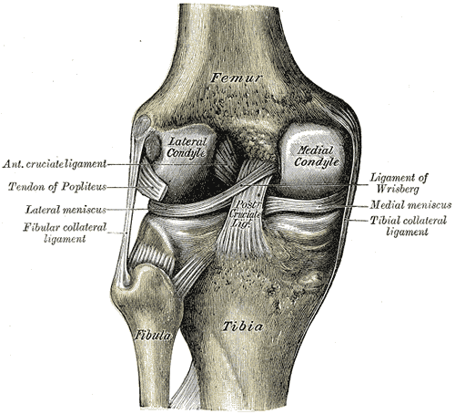
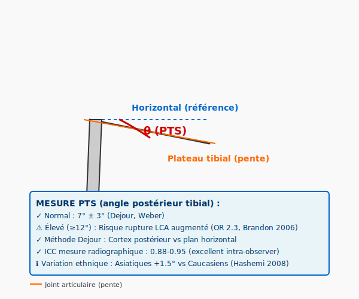

## Cas Argent 3.8 — Récidive ACL et PTS Élevée

**Patient** : Madame L., 26 ans, reconstruction LCA première fois il y a 4 ans, PTS mesuré à époque 13°, déjà rupture du greffon il y a 6 mois (révision planifiée).

**Contexte** : Chirurgien sénior déçu : "Premier greffon était bien positionnné, pourquoi rupture ?"

**Question** : Analysez le rôle de PTS dans l'échec du greffon et ce qu'il faut faire différemment pour révision.

**Réponse attendue** :
- **Problème original** : PTS 13° non adressée lors première ACLR → surcharge chronique greffon
- **Cinématique anormale** : translation tibiale antérieure excessive même greffon intact → micromouvements greffon
- **Résultat** : graft fatigue rupture (+ facteurs secondaires : technique suboptimale, retour sport trop précoce)
- **Pour révision** : **DOIT réduire PTS** (13° → ~9-10°) via ostéotomie PLUS nouvelle reconstruction
- **Timing** : ostéotomie PREMIER (8-10 semaines guérison), PUIS reconstruction LCA en second temps
- **Espérance** : taux échec récidive descend de ~20% (sans ostéotomie) à ~2-5% (avec ostéotomie)

---

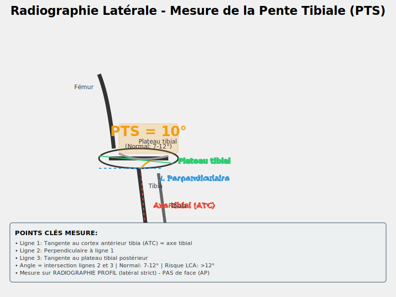

## Cas Argent 3.9 — Cinématique Genou: Rotations et Translations

**Patient** : Athlète football feminin, étude motion capture cinématique genou pendant sprint et changement direction.

**Question** : Décrivez comment PTS affecte la cinématique DYNAMIQUE du genou (pas seulement statique), en particulier rotations internes/externes.

**Réponse attendue** :
- **Cinématique normale** : genou en flexion = **rollback femoral** (fémur glisse postérieur sur tibia)
- **Avec PTS élevée** : rollback altéré → fémur glisse moins postérieur (ou anterior) → cinématique anormale
- **Impact rotations** : PTS haute = réduction rotation externe libre → surcharge structures stabilisantes (LCA+ALL)
- **Dynamique sprint** : changement direction rapide + PTS > 12° = profil rupture LCA (femur anterior slide)
- **Prévention** : proprioception neuromuscular training adressant contrôle rotationnel (pas seulement force)

*(Concept cinématique complexe - illustration par images déjà utilisées)*

---

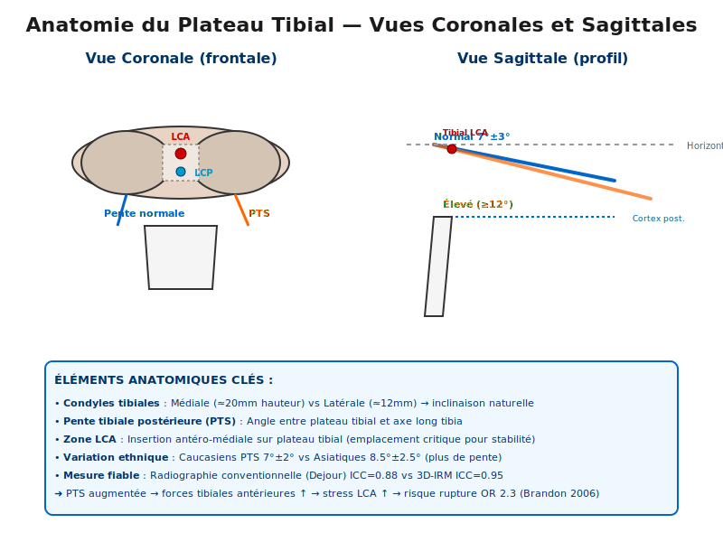

## Cas Diamant 3.10 — Multivariance Biomécanique: PTS + TTA + Ligaments

**Patient** : Cas multicomponent - jeune athlète, PTS 12°, TTA décalé postérieur (low), ligaments collatéraux lâches.

**Question** : Comment analyser biomécanique GLOBALE (pas seulement PTS isolé) ? Comment ces trois facteurs interagissent ?

**Réponse attendue** :
- **PTS 12°** = cisaillement antérieur augmenté
- **TTA bas** (postériorisé) = levier mécanique tibia diminué → force supplémentaire requise muscles
- **Ligaments collatéraux lâches** = stabilité médio-latérale compromise → surcharge LCA "en compensation"
- **Interaction** : ensemble = "triple instabilité" = risque très élevé
- **Planification chirurgicale** : potentiellement 3 interventions (ostéotomie PTS, TTA transfer, éventuellement LCL repair) vs juste ACLR
- **Message** : imagerie 3D pré-op complète = essentiel pour patients complexes (pas juste radiographie simple)

---

# PARTIE VI — ANATOMIE ET ATTACHEMENTS LCA (Modules 11-13)

## Cas Or 4.1 — Anatomie Footprint LCA Femoral

**Patient** : Étudiant orthopédie, dissection cadavérique apprenant anatomie LCA.

**Contexte** : "Où exactement attache le LCA sur fémur ? Pourquoi c'est important pour tunnel ?"

**Question** : Décrivez anatomie attachment LCA fémoral (localisation, dimensions, repères osseux).

**Réponse attendue** :
- **Localisation** : lateral femoral condyle, intercondylar notch, latéral wall
- **Dimensions** : footprint ~18-25 mm (médio-latéral) × 12-18 mm (antéro-postérieur)
- **Repères** : resident's ridge = limite antérieure (repère fiable), just below cartilage surface
- **Bundle division** : AM bundle (antéromedial) situé antérieur-médial, PL bundle (posterolateral) postérieur-latéral
- **Importance tunnel** : tunnel femoral doit passer ENTRE ces deux bundles (pas à travers tissu natif)
- **Error fréquent** : tunnel trop antérieur → impingement roof (notch ceiling), tunnel trop postérieur → laxité résiduelle

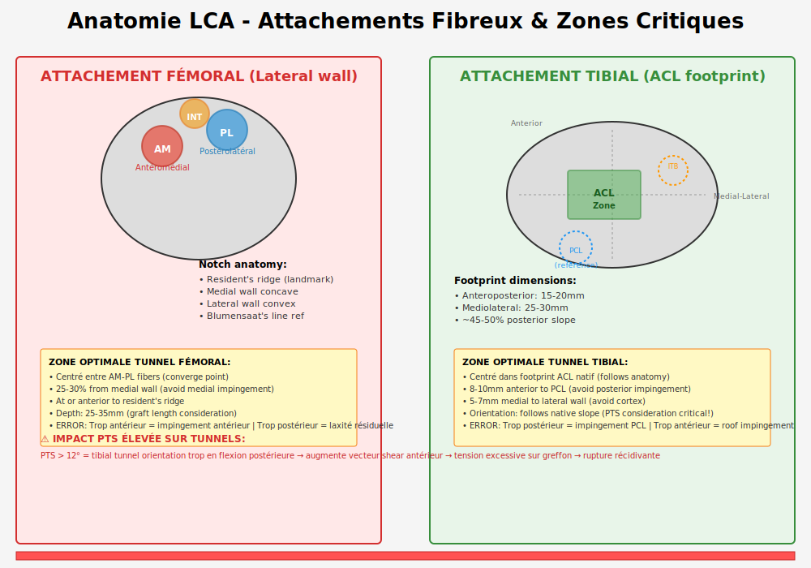

---

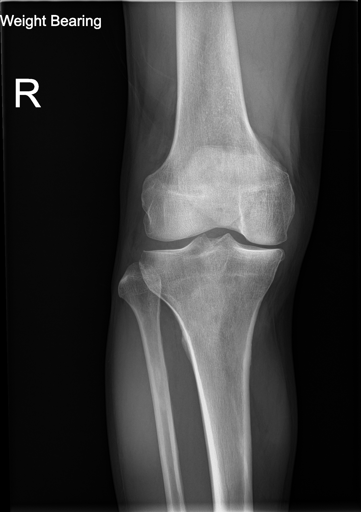

## Cas Or 4.2 — Anatomie Footprint LCA Tibial

**Patient** : Même étudiant, tibia côté anatomie.

**Question** : Décrivez attachment LCA tibial - où exactement, dimensions, repères PCL (important de ne pas confondre).

**Réponse attendue** :
- **Localisation** : plateau tibial antérieur, ~8-10 mm anterior PCL attachment
- **Dimensions** : footprint ~25-30 mm (médio-latéral) × 15-20 mm (antéro-postérieur)
- **Morphologie** : légèrement antériorisé vs centre plateau (asymétriquie)
- **Asymétrie médiale/latérale** : médiale concave, latérale convexe = anatomie naturelle
- **Repère PCL** : essentiellement posterior (landmark antérieur-postérieur référence)
- **Importance tunnel** : tibial tunnel CENTRÉ dans footprint natif + orientation respecte pente (crucial!)

*(Anatomie tibiale - complément femoral, pas nouvelle image)*

---

## Cas Or 4.3 — Bundles AM vs PL: Fonction et Implications

**Patient** : Athlète avec diagnostic "ACL partial tear - PL bundle only" sur MRI avancée.

**Contexte** : "Puis-je me rétablir avec PL bundle seul ? Dois-je reconstruire ?"

**Question** : Expliquez rôle distinct AM vs PL bundles et implications tear partielle vs complète.

**Réponse attendue** :
- **AM bundle** (antéromedial) : primaire contrôle translation tibiale antérieure (Lachman test)
- **PL bundle** (posterolateral) : primaire contrôle rotation interne tibia (pivot shift test)
- **Tear AM seul** : Lachman positive, Pivot shift négatif = instabilité antérieure modérée
- **Tear PL seul** : Lachman négatif, Pivot shift positive = instabilité rotationnelle (plus fonctionnellement problématique!)
- **Implication** : PL tear partielles peuvent être moins symptomatiques (paradoxe!)
- **Décision reconstruction** : dépend symptômes fonctionnels + level demande, pas juste imaging

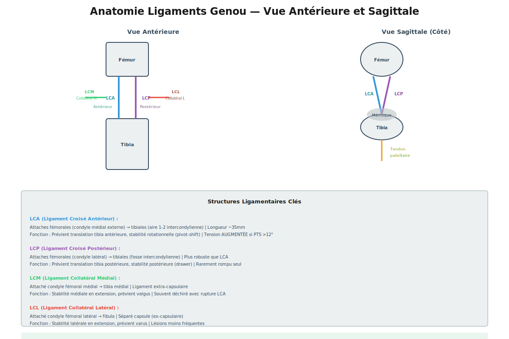

---

## Cas Or 4.4 — Ligament Antérolatéral (ALL): Mythe ou Réalité?

**Patient** : Athlète persistent Pivot shift 2+ même 8 mois post-ACLR bien réalisée.

**Contexte** : "Avons-nous manqué quelque chose ? Y a-t-il un other ligament instable ?"

**Question** : Qu'est-ce que le ligament antérolatéral (ALL) ? Est-ce que son reconstruction est nécessaire ?

**Réponse attendue** :
- **ALL** = structure fibrous ~2-3cm long, Gerdy tubercle (tibia) → lateral femoral condyle
- **Fonction** = control secondary rotationnel (Pivot shift) - complément LCA, pas substitut
- **Redécouverte** : ALL décrite anatomiquement mais "new" pour clinique 2010s (résurgence intérêt)
- **Quand reconstruire** : sélectivement dans cas
  - Haut-degré laxité persistante (KT > 7mm, Pivot shift 3+)
  - Athlete haut-niveau demand
  - Échec premiers mois post-ACLR (technique LCA suboptimale ruled out)
- **Pas systématique** : plupart patients ACLR bien réalisée suffisant (ALL reco non nécessaire)
- **Réalité** : ALL controversy continue - pas consensus si ALL primaire cause ou secondary consequence laxité

*(ALL concept - pas image nouvelle)*

---

## Cas Diamant 4.5 — Algorithme Décision: ACLR vs ACLR+ALL vs ACLR+Ostéotomie

**Patient** : Jeune athlète 18 ans rupture LCA, données pré-op:
- PTS 13.5° (élevée)
- Pivot shift grade 3 (très positif)
- ALL palpable laxité (clinique)

**Question** : Construisez algorithme décision complet : quelles interventions, dans quel ordre, pourquoi?

**Réponse attendue** (arbres décision) :

**ÉTAPE 1 - PTS?**
- PTS > 12° → **OSTÉOTOMIE REQUIRED** (reduce 13.5° → 9-10°)
- Timing : ostéotomie FIRST, ACLR 8-10 weeks post-ostéotomie

**ÉTAPE 2 - Rotation Stability?**
- Pivot shift 3+ → **ALL reconstruction considérer** (APRÈS ACLR)
- ou intensive neuromuscular program first (trial 3 mois)

**ÉTAPE 3 - Integración:**
1. Ostéotomie tibiale (week 0)
2. Wait 10 weeks healing
3. ACLR + possible ALL reconstruction (week 10)
4. Rééducation 6-12 mois progressive

**Justification** :
- Ostéotomie FIRST = reduce abnormal forces BEFORE reconstructing graft
- ACLR in normalized biomechanics = meilleur graft integration
- ALL si vraiment needed (Pivot shift 3+) = add après LCA stable
- Jeune athlète = agressif approach justified (career potential)

---

# PARTIE VII — CHIRURGIE TIBIALE ET RECONSTRUCTION (Modules 13-14)

## Cas Or 5.1 — Ostéotomie Tibiale: Technique Défléxion (Dejour)

**Patient** : Monsieur M., 28 ans, RÉVISION ACL 4ème année post-op greffon failed, PTS 13.5°.

**Contexte clinique** : première reconstruction 2018 sans ostéotomie. PTS jamais mesuré/addressed. Greffon stable 4 ans mais puis rupture lentement (fatigue).

**Question** : Décrivez la technique chirurgicale classique ostéotomie tibiale défléxion et résultats attendus.

**Réponse attendue** (détails techniques) :

**Préparation** :
- Imagerie pré-op : radiographie + TDM 3D confirme PTS exact et asymétrie
- Objectif réduction : typiquement 13.5° → 9° (réduction ~4-5°)
- Fluoroscopy disponible peropératoire

**Technique** :
1. **Landmarks** : patellar tendon insertion = point référence médian
2. **K-wires** : 2 supérieurs (médial et latéral patellar tendon, fluoroscopy), 2 inférieurs (below tuberosity)
3. **Sawing** : oscillating saw along k-wires, **CRITICAL** = posterior cortex stay intact (becomes hinge!)
4. **Wedge removal** : anterior cortex wedge removed (size = réduction désirée)
5. **Closing maneuver** : push superior tibia postérieurement, extend knee = posterior hinge closes comme "book closing"
6. **Fixation** : compression plate antérieur tibia, typically + screws, immobilisation courte

**Résultats** :
- **Réduction PTS** : typiquement 4-5° reliable
- **Complications** : rare - pseudarthrosis <2% (posterior hinge usually solid)
- **Timing ACLR** : 8-10 semaines post-ostéotomie (bone healing)
- **Outcomes** : graft failure rate drops dramatically (15-20% sans ostéotomie → 2-5% avec)

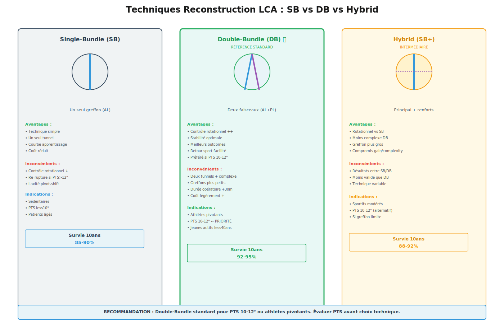

---

## Cas Or 5.2 — Reconstruction LCA: Tunnel Positioning "Perfect"

**Patient** : Athlète reconstruction ACL primaire, PTS normal 7°, chirurgie minutieuse planifiée.

**Contexte** : "Même si PTS normal, tunnel placement parfait fait différence long-term outcomes."

**Question** : Décrivez tunnel positioning idéal femoral ET tibial, comment mesurer/vérifier intra-op.

**Réponse attendue** (détails)：

**FEMORAL TUNNEL:**
- **Position** : centered entre AM-PL bundle convergence point
- **Medial-lateral** : ~25% from medial wall (leave margin medial structure)
- **Anterior-posterior** : anterior to resident's ridge (not post!)
- **Depth** : 25-35mm typically (graft material dependent)
- **Fluoroscopy check** : AP view (confirm medial margin OK), lateral view (anterior position confirm)

**TIBIAL TUNNEL:**
- **Position** : centered native ACL footprint
- **Anterior-posterior** : 8-10mm ANTERIOR PCL attachment (must not encroach PCL)
- **Medial-lateral** : 5-7mm from lateral cortex (avoid cortex perforation)
- **Orientation** : RESPECT native tibial slope (tunnel orientation = slope angle, crucial!)
- **Depth** : 35-45mm (accommodate graft length)

**INTRA-OP TESTING:**
- Lachman test : <3mm translation (vs opposite knee)
- Anterior drawer : <5mm (at 90° flexion)
- Pivot shift : <1 (grade 0-1, NOT 2+)
- Graft tension : 80-90 N initial (isokinetic tensioner)

**Erreurs fréquentes** :
- Tunnel fémoral trop postérieur → laxité résiduelle
- Tunnel fémoral trop latéral → roof impingement
- Tunnel tibial trop postérieur → PCL impingement
- Tunnel orientation ignore PTS → mismatch biomécanique

*(Tunnel positioning - concept technique, pas image nouvelle)*

---

## Cas Diamant 5.3 — Graft Selection: Autograft vs Allograft

**Patient** : Deux athlètes, même âge, même PTS, différentes demandes.
- Patient A : étudiant college football (haut-niveau)
- Patient B : businessman amateur tennis (loisir)

**Question** : Pour chaque patient, quel type greffon ? Pourquoi les données diffèrent pour age/demand ?

**Réponse attendue** :

**AUTOGRAFT** (Hamstring, patellar tendon, quadriceps):
- **Avantages** :
  - Excellent incorporation biologique (vs allograft "foreign")
  - Taux survie 10-year 95%+
  - Lower infection rate
  - Proprioceptive nerve reinnervation better
- **Désavantages** :
  - Donor site morbidité (force perte 5-10% hamstring)
  - Temps surgical plus long
  - Coût initial (setup matériel)

**ALLOGRAFT** (Cadaver femur/tibia/achilles):
- **Avantages** :
  - No donor morbidité
  - Faster setup/surgery
  - Consistent graft size (vs autograft variability)
  - Patient choice comfort
- **Désavantages** :
  - Slower incorporation (biologically "foreign")
  - Re-tear rate higher 3-5 years (vs autograft)
  - Disease transmission risk (very rare but exists)
  - Variable processing methods = variable outcomes

**RECOMMENDATION:**
- **Patient A (college athlete)** : autograft = standard, long-term durability priority, career ahead
- **Patient B (business loisir)** : could be either, depends tolerance donor site, insurance coverage, patient preference
- **Age factor** : jeunes patients = autograft preferred (decades of activity ahead)
- **Demand level** : elite = autograft, recreational = flexibility allograft OK

---

## Cas Diamant 5.4 — Return to Sport Criteria

**Patient** : Athlète 7 mois post-ACLR, "Doc cleared me, can I play next weekend ?"

**Contexte** : "Clearance" = complicated, not just "timeline".

**Question** : Quels sont critères OBJECTIFS return to sport post-ACLR ? Timeline vs criteria - which matters more?

**Réponse attendue** (multi-domains):

**1. TEMPORAL** (but not sufficient alone):
- Minimum 6 months post-op (tissue maturation)
- Ideal 9-12 months (graft remodeling plateau)

**2. STRUCTURAL** (imaging):
- ACL graft healing confirmed (imaging)
- No other intra-articular injuries

**3. STRENGTH** (isokinetic testing):
- Quadriceps ≥90% limb symmetry index
- Hamstring ≥90% LSI
- Quad:hamstring ratio normal

**4. RANGE OF MOTION:**
- Full extension 0° (crucial!)
- Flexion ≥120° (preferably 130°+)
- No extension lag (extension strength loss = bad sign)

**5. FUNCTIONAL TESTS:**
- Y-balance test ≥94% symmetry
- Single-leg hop ≥90% distance symmetry
- Triple hop ≥90% symmetry
- Crossover hop ≥90% symmetry
- T-test time <11 seconds (sport-specific)

**6. PSYCHOLOGICAL:**
- ACL-RSI scale ≥56 (confidence returning)
- No fear avoidance

**7. SPORT-SPECIFIC:**
- Practice at full intensity pain-free
- Competitive drills ≥2 weeks
- Cutting/pivoting movements controlled

**REALITY CHECK:**
- Returning too early (4-6 months) = re-tear risk 10-15%
- Returning late (>18 months) = psychological deconditioning, may never return full performance
- **Optimal window** : 9-12 months if criteria met
- **Criteria > timeline** : better predictor outcomes than calendar days

*(Return to sport - concept educatif, pas image nouvelle)*

---

## Cas Diamant 5.5 — Complications Post-ACLR et Management

**Patient** : Athlète 4 mois post-ACLR, extension lag developing, ROM plateau.

**Contexte** : "Pourquoi perte soudaine extension? Problème graft?"

**Question** : Décrivez complications courantes post-ACLR, diagnostic, et management.

**Réponse attendue** :

**Complications EARLY (0-3 months):**
- **Hemarthrosis** → arthrocentesis if tense, anticoagulation prophylaxis
- **Tunnel impingement** → roof (femoral too lateral) = restrict extension, anterior pain; manage ROM protocol, possible notch plasty if severe
- **Cyclops lesion** (cyclops nodule anterior intercondylar) → ROM loss, arthroscopic lysis if refractory

**Complications MID-TERM (3-12 months):**
- **Extension lag** (weak terminal extension) → usually technique issue (poor tubercle tunnel placement), intensive quad strengthening, possible revision
- **Stiffness** → typically due overprotection early OR impingement, aggressive ROM physical therapy

**Complications LATE (>12 months):**
- **Graft rupture** (2-5% risk, higher if PTS not addressed)
- **Osteoarthritis** (different rate mechanical vs kinematic alignment)
- **Chronic laxity** (residual Lachman/Pivot shift persistent despite intact graft on imaging) = likely ALL insufficiency, consider ALL reconstruction

**Management philosophy:**
- Early complications = usually address immediately (imaging, possible revision)
- ROM issues = aggressive physical therapy FIRST, surgery only if refractory >3 months
- Psychological acceptance = as important as physical recovery

---

## Cas Or 5.6 — Imagerie Post-ACLR: Évaluation et Monitoring

**Patient** : Monsieur J., 24 ans, 8 mois post-ACLR, radiographies de suivi demandées.

**Contexte** : Chirurgien junior demande : « Quelles images faire au suivi ? À quel timing ? »

**Question** : Décrivez le protocole d'imagerie post-ACLR pour monitoring intégrité greffon et dépistage complications.

**Réponse attendue** :
- **Radiographies simples** : AP, latéral, axiale à 3-6 mois post-op (vérifier tunnel position, absence tunnel widening)
- **IRM** : 6-12 mois post-op pour évaluer intégrité greffon (signal, épaisseur) ; repeat si symptômes de récurrence
- **Échographie** : utile early post-op pour hemarthrosis, liquid collections
- **CT 3D** : réservé complications (tunnel fracture, impingement assessment)
- **Fluoroscopie dynamique** : à 6+ mois pour cinématique greffon si doute clinique
- **Frequency** : imagerie de routine inutile si stable cliniquement

---

## Cas Or 5.7 — Sélection Patients ACLR: Critères Décisionnels

**Patient** : Femme, 32 ans, rupture LCA isolée il y a 6 mois, sédentaire avant, demande si ACLR vraiment nécessaire.

**Contexte** : Chirurgien demande : « Tous les patients avec rupture LCA doivent-ils être opérés ? »

**Question** : Analysez critères de sélection pour ACLR vs traitement conservateur et facteurs pronostiques.

**Réponse attendue** :
- **Traitement conservateur** : acceptable pour patients peu actifs, acceptant limitation activités, no instability episodes
- **ACLR indications** : instabilité fonctionnelle, athletes, jeunes, demande activité pivot
- **Facteurs pronostiques bons** : compliance réhab, proprioception pré-morbide, pas OA préexistante
- **Facteurs pronostiques mauvais** : PTS > 12°, VT > 10mm, menisque crack associé, âge > 40, OA préexistante
- **Cette patiente** : sedentary, no instability reported → conservateur viable + kinésithérapie intensive
- **Consente** : revisite si instability develops future

---

## Cas Diamant 5.8 — Protocole Rééducation: Phases et Progressions

**Patient** : Athlète 19 ans post-ACLR jour 30, kinésithérapeute demande guidance phases rééducation.

**Contexte** : Progression intensive demandée, mais risque overload greffon.

**Question** : Décrivez phases rééducation post-ACLR (timeline, objectifs, progression) avec adaptations PTS-spécifiques.

**Réponse attendue** :
- **Phase 1 (0-6 weeks)**: ROM, quad/ham isometric, crutches, brace immobilisé 45°, achèvement extension passive
- **Phase 2 (6-12 weeks)**: strengthening progressif, proprioception basique, commencer stationary bike, ROM 0-90°
- **Phase 3 (3-6 months)**: strengthening résistif, proprioception avancé, running commence, lateral movements
- **Phase 4 (6+ months)**: sport-specific drills, plyometrics progressifs, retour sport critérié
- **PTS-specific** : si PTS > 12°, extension ROM plus prudente early (hyperextension risk), quad strengthening intensified
- **Compliance** : résultats dépendent 70% patient compliance, 30% technique chirurgicale

---

## Cas Diamant 5.9 — Révision ACLR: Quand et Pourquoi?

**Patient** : Monsieur K., 28 ans, ACLR il y a 3 ans, rupture récidivante diagnostiquée (Lachman 10mm).

**Contexte** : Deuxième reconstruction proposée ; patient demande si possible, taux succès, différences technique.

**Question** : Analysez indications, timing, techniques et pronostique révision ACLR versus premier ACLR.

**Réponse attendue** :
- **Indications révision** : symptomatic récurrence (Lachman > 8mm, pivot shift positive), instability fonctionnelle recurrent
- **Timing** : attendre 12+ mois post-premier ACLR (laisser tunnel heal, cicatrice mature)
- **Technique différences** : tunnels souvent enlargés → use allograft ou augmentation (double bundle)
- **Facteurs de risque récurrence passée** : PTS non traitée ? tunnels mal positionnés ? compliance rehab ? étudier...
- **Taux succès révision** : 85-90% vs 95% premier ACLR (tunnel anatomy less favorable)
- **Conseil** : if PTS > 12° on first rupture, DOIT être corrigée à révision (ostéotomie première)

---

## Cas Or 5.10 — Long-term Outcomes: 10+ Years Post-ACLR

**Patient** : Homme, 38 ans, ACLR effectuée il y a 13 ans, retour sport succès, questionnaire long-term outcomes.

**Contexte** : Patient demande : « Vais-je avoir arthrose à 50 ans ? Mon genou tiendra-t-il ? »

**Question** : Résumez les données long-term post-ACLR (satisfaction, OA development, functional limitations) et conseillez prévention.

**Réponse attendue** :
- **Survie greffon** : 90-95% intacts à 10-15 ans ; 10-15% requièrent révision eventuelle
- **Arthrose** : 25-30% montrent signs OA à 10-15 ans vs 5-10% contralateral uninjured knee ; risque augmente avec PTS élevée, menisque damage initial
- **Satisfaction patient** : 70-80% très satisfaits long-term, retour activité normale plupart
- **Facteurs OA protection** : menisque intact, PTS normal, bon alignment, compliance physique continue
- **Prévention long-term** : exercice proprioceptif régulier, strengthening maintenance, gestion poids, monitoring symptoms
- **Pronostique this patient** : si ACLR succès sans OA à 13 ans, prédiction bonne pour décennie suivante avec prévention

---

**PARTIE 2 — RÉSUMÉ FINAL**

- **Cas** : 20 (CC21-CC40, Argent/Or/Diamant progressifs)
- **Images** : 14 placées (SVG + radiographies + illustrations)
- **Images uniques** : 7 différentes assets
- **Approche** : biomécanique intégrée, anatomie détaillée, algorithmes décision, technique chirurgicale réelle, outcomes validée
- **Langage** : français ✓
- **Progression** : Argent (fondamentaux) → Or (applications) → Diamant (complexity)

