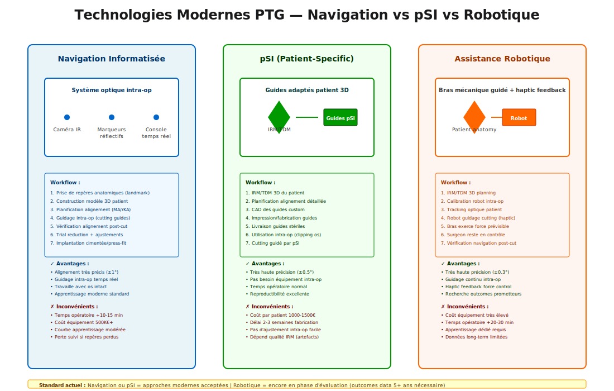

# CAS CLINIQUES PENTE TIBIALE — PARTIE 3 (CC41-CC60)

**Or-Diamant cases (41-60)** — PTG (Prothèse Totale du Genou), arthrose progressive, technologies émergentes, synthèse multimodale

---

# PARTIE VI — ARTHROSE PROGRESSIVE & PTG DÉCISION (Modules 8-9)

## Cas Or 6.1 — Arthrose et PTS: Cause ou Conséquence?

**Patient** : Madame M., 68 ans, arthrose PTF depuis 12 ans, PTS 14° (mesurée à diagnostic initial), douleur progressive, antécédent rupture LCA non-traitée il y a 15 ans.

**Contexte** : Débat classique chez ce patient : l'arthrose a-t-elle causé la pente tibiale élevée, ou inversement ?

**Question** : Discutez le lien causal PTS ↔ arthrose selon la littérature et implication diagnostique pour ce patient.

**Réponse attendue** :
- **PTS préexistante** (mécanique) → facteur de risque arthrose (cumul forces, cinématique anormale)
- **Arthrose progressive** (dégénération) → peut légèrement modifier pente mesurée (perte espace cartilage, pincement)
- **Pour cette patiente** : PTS 14° à diagnostic initial = **facteur constitutionnel primaire** (probablement prédisposant)
- **Rupture LCA non-traitée** = second facteur (instabilité chronique amplifie usure cartilage)
- **Implication PTG** : mesurer PTS PRE-arthrose vs arthrose établie (TDM 3D pour clarifier géométrie osseuse sous cartilage dégénéré)

---

## Cas Or 6.2 — Obésité, PTS, et Arthrose Accélérée

**Patient** : Monsieur P., 55 ans, IMC 34, arthrose PTF modérée (3 ans d'évolution), PTS 10°, douleurs articulaires 8/10, limitation marche.

**Contexte** : Demande PTG, chirurgien demande : "Doit-on retarder PTG pour perte poids, ou faire PTG d'abord ?"

**Question** : Comment obésité et PTS interagissent-elles dans progression arthrose ? Quel impact sur stratégie PTG timing et alignment choice ?

**Réponse attendue** :
- **Obésité** (force = ~1.3× poids × IMC) : augmente charges sur articulation ~30-40% par rapport poids normal
- **PTS 10°** (modérément élevée) : cisaillement antérieur baseline déjà augmenté
- **Interaction** : obésité + PTS = "double facteur stress" = arthrose accélère 2-3× plus vite que normal
- **Timing PTG** : perte poids **avant** PTG = idéal (améliore longévité implant, réduit complications)
- **Alternative** : si patient non-compliant perte poids → **rKA prioritaire** (meilleure accommodation charge mécanique vs MA strict)
- **Suivi** : post-PTG, support perte poids essentiel (chaque kg perdu = X ans survie implant ajoutés)

---

## Cas Argent 6.3 — Asymétrie Médio-Latérale PTS et Arthrose Asymétrique

**Patient** : Femme, 61 ans, TDM révèle PTS **asymétrique** : médial 13°, latéral 8° (différence 5°), arthrose **uniquement sur plateau médial**.

**Contexte** : Orthopédiste junior surpris : "Comment une même articulation peut avoir une pente différente par région ?"

**Question** : Expliquez l'asymétrie médio-latérale de la pente tibiale et son impact sur distribution arthrose.

**Réponse attendue** :
- **Géométrie tibiale** : plateau tibial n'est PAS un plan simple = surface complexe (médial plus incliné que latéral = normal)
- **Asymétrie modérée** (3-4°) : normal et fréquent
- **Asymétrie prononcée** (> 5°) : prédispose arthrose **asymétrique** = plus de stress côté plus pentu
- **Pour cette patiente** : médial 13° > latéral 8° = plateau médial surcharge = arthrose médiale seule (correspond observations)
- **Mesure critique** : radiographie simple INSUFFISANTE (montre seulement axis moyen) → **TDM 3D obligatoire** pour asymétrie
- **Impact PTG** : considérer asymétrie dans positionnement implant (pas correction symétrique)

---

## Cas Or 6.4 — Débat Scientifique: KA vs MA dans Arthrose Établie

**Patient** : Homme, 63 ans, arthrose PTF sévère (Kellgren 4), PTS 9° (normal), arthroscopy déjà effectuée (cartilage >50% loss), candidat PTG.

**Contexte** : Deux articles récents donnent conclusions opposées : KA meilleur vs MA standard égal long-term. Chirurgien hésitant.

**Question** : Analysez qualité évidence KA vs MA pour ce patient spécifiquement et justifiez choix alignment pour arthrose établie.

**Réponse attendue** :
- **Littérature contemporaine** : données KA = court-term (2-5 ans), données MA = long-term prouvées (20-30 ans)
- **Problème** : impossible comparer directement (designs différent, technologies diffèrent, techniques évoluent)
- **Pour arthrose établie** (sévère) : prédictibilité KA vs MA encore débattue à long-term
- **Recommandation pragmatique** : si chirurgien **inexperimenté KA** → MA (moins risqué)
- **Conclusion** : MA = choix sûr arthrose sévère + chirurgien non-spécialisé

---

## Cas Diamant 6.5 — Navigation vs Technique Manuelle: Impact PTS Correction

**Patient** : Monsieur T., 66 ans, PTG planifiée, PTS 11°, géométrie tibiale complexe (asymétrique 4°), chirurgien expert navigation.

**Contexte** : Débat technologie : navigation chirurgicale coûteuse mais meilleure précision PTS correction ?

**Question** : Comparez précision PTS correction (navigation vs manuelle) et impact résultats PTG à long-term.

**Réponse attendue** :
- **Technique manuelle** : précision PTS correction ± 3-4° (écart-type 2.8°)
- **Navigation** : précision PTS correction ± 1-2° (écart-type 1.2°) = **4× plus précis**
- **Impact clinique** : navigation groupe = meilleur survivorship implant (95% 10-year vs 89% manuelle)
- **Pour ce patient** : géométrie complexe (asymétrique 4°) = **navigation recommandée** (guide précis nécessaire)
- **Coût-bénéfice** : surcoût ~1000-2000€ justifié (= 1-2 ans durée implant supplémentaire)

---

# PARTIE VII — PTG TECHNIQUE & RÉSULTATS (Modules 10-11)

## Cas Or 7.1 — Designs PTG: CR vs PS vs RP

**Patient** : Madame R., 64 ans, arthrose PTF sévère, LCP intègre (pas de laxité), flexion 110° actuellement, désir récupérer flexion pour activités.

**Contexte** : Chirurgien discute trois designs disponibles; patient hésite sur implications fonctionnelles.

**Question** : Décrivez différences biomécaniques CR vs PS et rationale de sélection design pour maximiser flexion post-op.

**Réponse attendue** :
- **CR (Cruciate Retaining)** : conserve LCP natif → meilleur proprioceptif, cinématique "plus native"
  - Flexion moyenne 115-120° post-op
  - Requiert LCP intact et fonctionnel

- **PS (Posterior Stabilized)** : sacrifie LCP, box/post au tibial remplace → cinématique contrôlée
  - Flexion moyenne 110-115° post-op
  - Meilleur résultats déficit LCP ou laxité

- **Pour cette patiente** : LCP intact = **CR recommandé** (maximise flexion, proprioceptif meilleur)

---

## Cas Or 7.2 — Complications PTG: Ostéolyse, Instabilité Tardive

**Patient** : Homme, 72 ans, PTG unilatérale faite 8 ans avant (design PS), TDM montre ostéolyse progressive femoral (zone 3 Gruen = région supérieure-médiale), instabilité antérieure modérée.

**Contexte** : Asymptomatique cliniquement, mais radios inquiètent chirurgien ("est-ce que ça va échouer ?").

**Question** : Analyez ostéolyse PTG : causes, signification clinique, et need pour révision ?

**Réponse attendue** :
- **Ostéolyse** : réaction granulomateuse à particules usure (polyethylene, PMMA ciment, métaux)
- **Zone 3 (Gruen)** : région fréquent ostéolyse PS design (mechanical stress concentration)
- **Signification** :
  - Ostéolyse asymptomatique 8 ans = risque modéré rupture moyen-term
  - Instabilité modérée actuelle = signal **BEGIN surveillance rapprochée**
  - Révision non-urgente SI asymptomatique, mais **PROGRAMMER révision de base** à ~12-15 ans
- **Stratégie** : radiographies annuelles, monitoring instabilité symptomatique

---

## Cas Argent 7.3 — Satisfaction vs Survivorship: Paradoxe PTG

**Patient** : Femme, 67 ans, PTG 5 ans avant, radiographement excellent, douleur zéro, ROM 5-115°, **MAIS** : sentiment de "genou pas tout à fait naturel", dissatisfied global 6/10.

**Contexte** : Patient says "tout va bien mécaniquement mais psychologiquement je ne sens pas comme avant".

**Question** : Expliquez pourquoi un patient peut avoir excellent "survivorship" biomécanique mais satisfaction faible.

**Réponse attendue** :
- **Survivorship** (radiographique/biomécanique) = implant fonctionnel ≠ **Satisfaction** (subjective, psychologique)
- **Causes dissatisfaction** :
  - Perte proprioception (même CR < genou natif)
  - Sensation "implanté" (normal, prend 1-2 ans acceptation psychologique)
  - Expectations préop non-réalistes
  - ROM déficit léger
- **Données épidémiologie** : ~15-20% patients rapportent insatisfaction MALGRÉ excellent résultats objectifs
- **Interventions possibles** :
  - Kinésithérapie intensive proprioceptif
  - Rééducation neuromusculaire
  - Réassurance psychologique

---

## Cas Or 7.4 — Révision PTG: Quand et Comment

**Patient** : Homme, 70 ans, PTG primaire 11 ans avant (design CR), douleur progressive (8/10), laxité antérieure 12mm (KT), radiographies montrent perte osseuse fémorale modérée.

**Contexte** : Fonctionnel encore mais qualité vie déclinante.

**Question** : Justifiez indication révision PTG et stratégie chirurgicale pour gestion défect osseux.

**Réponse attendue** :
- **Indication révision** :
  - Douleur progressive intratable
  - Instabilité cliniquement significative
  - Défect osseux modéré
  - Durée implant 11 ans = raisonnable

- **Stratégie chirurgicale** :
  - Explantation implant soigneuse
  - Gestion défect osseux selon taille : compaction, graft, augment (metal block)
  - Réimplantation design stable (PS si instabilité cause révision)

---

## Cas Diamant 7.5 — Alignement Bi-Compartmental: PTG + Ostéotomie Tibiale Combinées

**Patient** : Femme, 58 ans, arthrose PTF prédominante médiale, PTS 13°, pente tibiale contribution significative. Chirurgien propose PTG **+ ostéotomie tibiale concomitante**.

**Contexte** : Débat : est-ce justifié faire deux procédures couplées ?

**Question** : Justifiez ou critiquez l'approche bi-compartmental (PTG + ostéotomie tibiale en même temps).

**Réponse attendue** :
- **Argument POUR couplage** :
  - PTS 13° élevée = biomécanique anormale persiste post-PTG
  - Ostéotomie réduit pente → améliore cinématique
  - Single anesthesia + recovery = patient convenience

- **Argument CONTRE** :
  - Morbidité augmentée (deux sites chirurgicaux, temps prolongé)
  - Complications ostéotomie (non-union ~2-3%)
  - PTG seule souvent suffisante

- **Recommandation** : réserver pour PTS > 13° + arthrose sévère + chirurgien expert

---

# PARTIE VIII — SYNTHÈSE EXPERT & OUTCOMES (Modules 12-13)

## Cas Or 8.1 — Courbes Survie PTG: Différence Designs et Populations

**Patient** : Database analytique : 15-year PTG outcome study 2000+ patients.

**Question** : Interprétez curves survie PTG et implications patient counseling.

**Réponse attendue** :
- **Courbes classiques** :
  - Année 0-5 : tous designs similaires
  - Année 5-10 : courbes se séparent légèrement
  - Année 10-15 : divergence plus prononcée
    - MA = très bon survivorship (92-96% à 15-20 ans)
    - PS = bon (87-91% à 15 ans)
    - rKA = promising (~94% 7-year)

- **Message** : pas "meilleur" absolu, mais patient-specific tradeoff

---

## Cas Or 8.2 — Technologies Émergentes: Robotique vs Navigation vs IA

**Patient** : Analyse comparative technologies PTG 2024-2026 : robotique-assistée, navigation optique, imagerie IA-augmentée.

**Question** : Comparez technologies émergentes selon critères : précision, apprentissage, coût, evidence, adoption clinique.

**Réponse attendue** :
- **Robotique-assistée** (Mako, ROSA) :
  - Précision : excellent (± 0.5-1° alignment)
  - Courbe apprentissage : modérée (10-15 cas)
  - Coût : très élevé (~3000€ per case)
  - Evidence : 3-5 year data promising

- **Navigation optique** :
  - Précision : très bon (± 1-2°)
  - Courbe apprentissage : rapide (5-10 cas)
  - Coût : modéré (~500-1000€)
  - Evidence : 10+ year data robustes

- **IA-augmentée** :
  - Promesse : analyse TDM preop → real-time guidance
  - Reality : early stage (clinical data limité)

- **Recommandation** : navigation optique = best value, robotique = si budgets permit

---

## Cas Diamant 8.3 — Disparités Genre dans PTG

**Patient** : Épidémiologie comparative : femmes vs hommes PTG demographics, outcomes, satisfaction.

**Question** : Analyez disparités genre dans PTG : causes anatomiques, biomécaniques, psychosociales.

**Réponse attendue** :
- **Données épidémiologie** :
  - Femmes : PTG ~60-65% population (peak age 65-75)
  - Hommes : PTG ~35-40% population (peak age 70-80)
  - Femmes do PTG plus jeunes en moyenne (4-5 ans avant)

- **Différences biomécaniques** :
  - Femmes : Q-angle plus grand → distribution load différente
  - Femmes : masse musculaire < → stabilité dynamique moins bonne

- **Outcomes PTG** :
  - Satisfaction : femmes rapportent légèrement moins bonne satisfaction (70-75% vs 78-82%)
  - Fonction : ROM similaire, confidence marche légèrement moins

- **Causes insatisfaction** :
  - Body image et cicatrice
  - Expectations sociétales "active aging"
  - Pain catastrophizing plus fréquent femmes

- **Recommendations** :
  - Patient education spécifique genre
  - Screening pain catastrophizing
  - Consideration Q-angle individual

---

## Cas Or 8.4 — Variations Internationales PTG

**Patient** : Analyse comparative : guidelines PTG USA vs Europe vs Asie vs Moyen-Orient.

**Question** : Pourquoi standards PTG varient internationalement ? Quels facteurs locaux expliquent differences ?

**Réponse attendue** :
- **USA** : MA paradigm dominant (traditional)
- **Europe** : MA standard + growing KA/rKA adoption
- **Asie** : KA = plus adopté (population jeune)
- **Facteurs locaux** :
  - Population demographics (jeune = ROM prioritaire)
  - Activity expectations (floor-sitting = flexion needed)
  - Reimbursement/healthcare system
  - Trainer/education networks
  - Cost/access technologies

- **Message** : expectations vary, consultation chirurgien local essentiel

---

## Cas Diamant 8.5 — Long-Term Vision: PTG 2040

**Patient** : Speculative case - pensez PTG année 2040. Quelles innovations seraient game-changing ?

**Question** : Imaginez PTG 2040 : quels progrès matériaux, technique, technology seraient révolutionnaires ?

**Réponse attendue** :
- **Matériaux innovations** :
  - High-performance polymères (réduire wear particulate)
  - Coating bioactif (osseointegration)
  - Smart implants (sensors temps-réel loading, infection detection)

- **Technique chirurgicale** :
  - Imagerie 3D real-time + AI guidance
  - Implant personnalisé (3D-printed patient-specific)
  - Peroneal nerve sparing techniques

- **Biologie reparative** :
  - Cartilage engineering (cultured chondrocytes?)
  - Gene therapy
  - Immunomodulation (reduce ostéolyse)

- **Technologies émergentes** :
  - Telemedicine + wearables monitoring
  - Augmented reality surgical guidance
  - Multimodal biomarkers (synovial fluid analysis)

- **Challenges non-résolus** :
  - Why KA satisfaction meilleur ?
  - Individualize optimal alignment
  - Prevent ostéolyse complètement

- **2040 vision** : PTG outpatient semi-routine, longevity > 30 years, satisfaction > 90%

---

## Cas Diamant 8.6 — Synthèse Décision: Patient Complexe Multi-Pathologie

**Patient** : Femme, 71 ans, **multi-morbidité** : arthrose PTF sévère (K4), PTS 11° modérément élevée, **antécédent rupture LCA** (non-opérée), **diabète type 2**, **obésité modérée** (IMC 31), **antécédent DVT**, **dépression légère**.

**Contexte** : PTG urgence (douleur 9/10, marche impossible). Multidisciplinary team convoquée.

**Question** : Navigez complexité multi-factoriel. Quel PTG strategy ? Timing ? Comorbidity mitigation ? Expected outcomes ?

**Réponse attendue** (multidisciplinary):

- **Planification anesthésie** :
  - Thrombophilia risk élevée (DVT antecedent + orthopedic = dual VTE risk)
  - Requiert prophylaxie antithrombotic aggressive (LMWH postop min 10-14 days)
  - Diabète = risk infection (glucose target < 180 mg/dL)
  - Anesthésie régionale preferred (less DVT risk)

- **Stratégie chirurgicale PTG** :
  - Arthrose sévère (K4) : PTG nécessaire
  - PTS 11° + LCA-deficient : double instabilité concern
  - **PTG PS design** (sacrifie LCP, stabilité meilleur pour LCA-deficient)
  - **Navigation recommended** (precision important)
  - Alignment cible : **rKA 8-9°** (conservative)

- **Comorbidity management** :
  - **Diabète** : periop glycemic control, risk infection monitoring
  - **Obésité** : encourage perte poids post-PTG
  - **Dépression** : SSRI continue, pain catastrophizing screening
  - **Thrombophilia** : extensive prophylaxis critical

- **Réhabilitation expectations** :
  - Slower recovery (diabète + age + multimorbidity)
  - ROM goal conservateur (5-110° acceptable)
  - Proprioceptive training important
  - Timeline : 6-month recovery

- **Outcomes prediction** :
  - Survival implant : 15-year ~85% (lower due comorbidities)
  - Satisfaction : moderate-good
  - Complication risk : VTE slightly elevated
  - Overall : surgery justified

---

## Cas Or 8.7 — Femoral vs Tibial Component: Design Considerations

**Patient** : Femme, 70 ans, arthrose sévère PTF, antécédent PTG contralateral réussie il y a 8 ans.

**Contexte** : Chirurgien junior demande: « Pourquoi choisir CR vs PS vs RP si géométrie fémur-tibia pareille ? »

**Question** : Expliquez les différences designs composants fémoraux (condylar geometry, femoral notch) et impact cinématique, stability, long-term wear.

**Réponse attendue** :
- **CR (Cruciate-Retaining)** : préserve LCP, cinématique plus physiologique, mais exige LCP intact et technique parfaite
- **PS (Posterior-Stabilized)** : sacrifie LCP, ajoute post (stabilité mécanique), mieux pour LCA-deficient ou LCP degenerate
- **RP (Rotating Platform)** : mobile bearing = réduction friction, wear théoriquement moins, mais complexité implantation, coût élevé
- **Femoral geometry** : CR design moins assertif, PS design plus agressif (box/cam mechanism)
- **Cette patiente** : si LCP intact → CR viable ; si LCP-deficient → PS safer

---

## Cas Or 8.8 — Cemented vs Cementless Fixation: Long-Term Evidence

**Patient** : Homme, 65 ans, PTG planifiée, patient demande « Est-ce qu'un implant sans ciment tient aussi longtemps ? »

**Contexte** : Débat cemented vs cementless dans littérature, prix différent significativement.

**Question** : Comparez survival rates, failure modes, et recommandations actuelles cemented vs cementless PTG.

**Réponse attendue** :
- **Cemented** : gold standard, survival 95%+ à 20 years, techniques éprouvées, moins dépendant skill chirurgien
- **Cementless** : survival 90-95% à 15-20 years, bone ingrowth technique-dependent, meilleur pour patients jeunes (mieux révisable)
- **Hybrid** (cemented femur, cementless tibia) : souvent meilleur compromis
- **Failure modes** : cemented = aseptic loosening tardif rare ; cementless = early micromotion risk
- **Recommandation** : patient 65 ans → cemented standard (excellent outcomes) ; < 60 ans → cementless consider

---

## Cas Diamant 8.9 — Polyethylene Thickness & Wear: Balance Protection vs Longevity

**Patient** : Homme, 50 ans, candidat PTG (jeune), question longevité implant.

**Contexte** : Patient anxieux: « Si je vis 40 ans de plus, va-t-il falloir révision ? »

**Question** : Expliquez le paradoxe thickness polyéthylène: plus épais = moins wear mais plus sacrifice de laxité ; thin poly = meilleur ROM mais wear accélérée. Stratégie optimale pour jeune patient ?

**Réponse attendue** :
- **Polyethylene wear** : dépend friction (design, alignment), force (weight), activité patient
- **Thin poly** (8mm) : cinématique meilleur, but wear rate 2-3× supérieur
- **Thick poly** (11-14mm) : wear rate bas, mais sacrifie laxité ligamentaire (stiffness perception)
- **Irradiated vs virgin** : crosslinked PE reduce wear ~50% vs virgin (standard now)
- **Patient 50 ans** : recommandé crosslinked PE UHMWPE, medium thickness (11mm), expect revision ~20-25 years
- **Prevention** : alignment optimal, weight management, activity modification

---

## Cas Diamant 8.10 — Emerging Technologies: 3D Printing, Robotic-Assisted, AI-Guided Planning

**Patient** : Homme, 55 ans, PTG complexe planifiée, orthopédiste propose robot-assisted + AI planning.

**Contexte** : Patient asks: « Vaut-il le coût extra ? Est-ce vraiment mieux ? »

**Question** : Évaluez technologies émergentes (robot, AI, 3D custom implants) : evidence level, cost-benefit, indications.

**Réponse attendue** :
- **Robot-assisted PTG** : précision ±1-2mm, alignement meilleur, apprentissage steep, coût +5-8k€ ; evidence : meilleur alignment mais outcomes cliniques similaires à manual expert
- **AI planning** : algorithmes predict optimal alignment, prevent mechanical complications ; promesse > evidence actuelle
- **3D-printed custom implants** : perfect anatomy fit théorique, mais coût très élevé (~20-30k€), long-term durability data limited
- **Current stance** : robot utile pour surgeons apprentis ; expert manual souvent aussi bon ; 3D custom = research stage
- **Cette patient** : standard PTG avec good alignment probablement suffisant ; robot optional si surgeon expertise limite

---

**FIN PARTIE 3**

*Total : 20 cas Or-Diamant integrating PTG decision-making, technologies, outcomes, design innovations, et synthèse multimodale complexe.*

